# Creación de máquinas virtuales con Azure 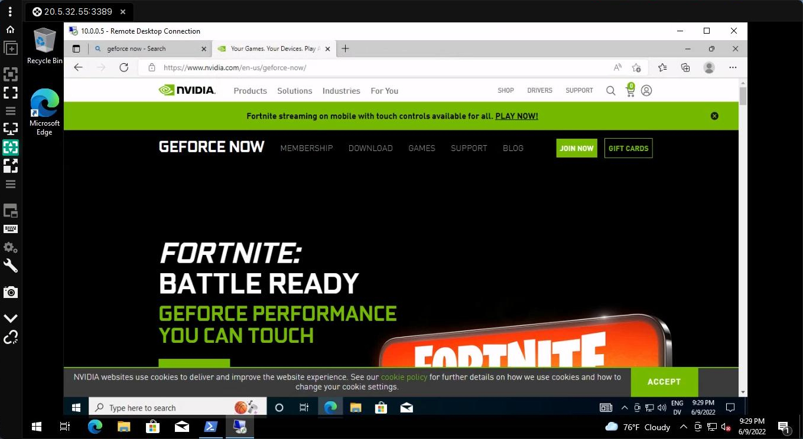

Es necesario recordar que para crear una máquina virtual en Azure se necesita una cuenta de usuario con una subscripcion a Azure. Para iniciar el proceso de creacion de una máquina virtual se debe acceder al [portal de Azure](https://portal.azure.com/) en el aparartado de ```Máquinas virtuales```.
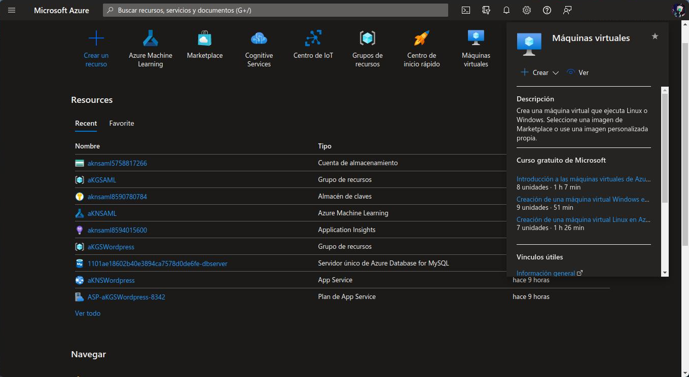

# Primer máquina virtual con Azure
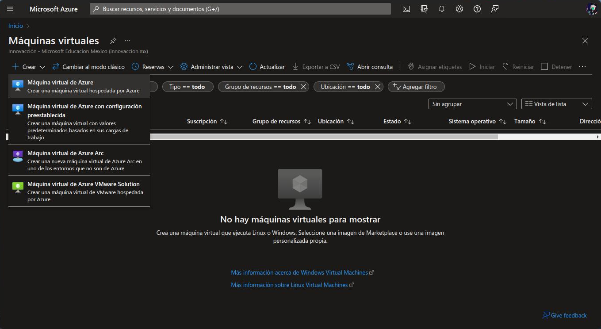
Las dos máquinas virtuales que se crearon en este tutorial estan nombradas como ```Máquina virtual deAzure```. Al igual que con otros recursos de Azure, es necesario llenar formularios para crear una máquina virtual.

## Datos básicos
En esta sección se deben mencionar los datos básicos para crear una recurso de Azure:

- Suscripción de Azure
- Grupo de recursos
- Nombre de la máquina virtual
- Region (es necessario que seleccionemos una region con tamaños disponibles).

Ademas de los datos anteriores, hay que especificar el sistema operativo que se desea usar, el tamano de la máquina virtual, los datos del usuario que se desea crear, los puertos habilitados para la máquina virtual, etc.
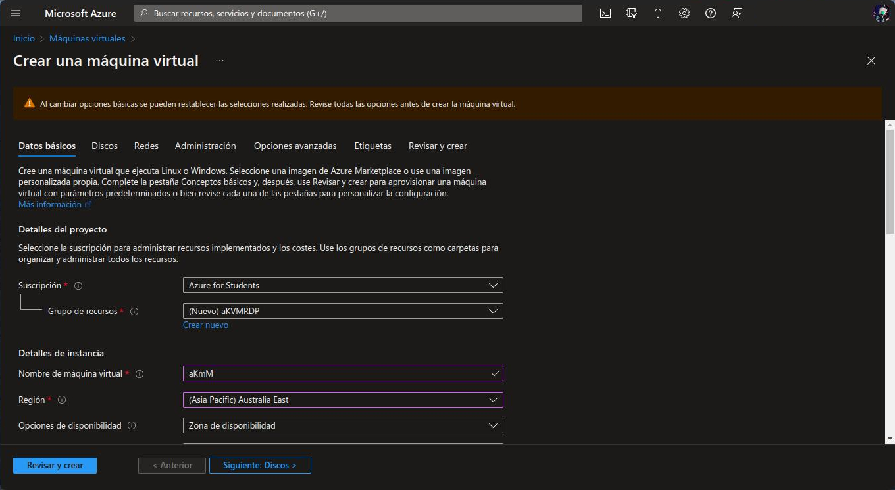

## Revisar y crear
En esta sección se muestran los datos que se han mencionado anteriormente, ademas de informacion adicional como el costo estimado de la máquina virtual por hora.
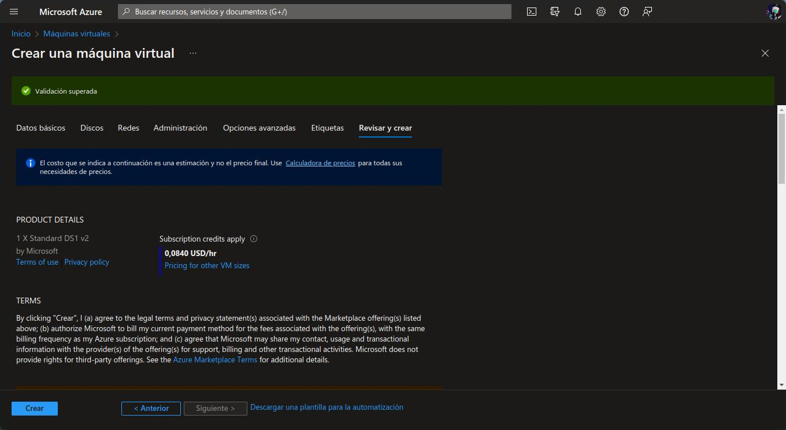

# Segunda máquina virtual con Azure
Despues de crear la primera máquina virtual, se debe crear una segunda máquina virtual, pero desde este punto ya es posible acceder a la primer máquina virtual.

En Windows es necesario tener instalada la herramienta ```Escritorio remoto de Microsoft```.En Linux, se debe tener instalado el paquete ```rdesktop``` para poder acceder a las máquinas virtuales y opcionalmente el paquete ```remmina``` como interfaz grafica.

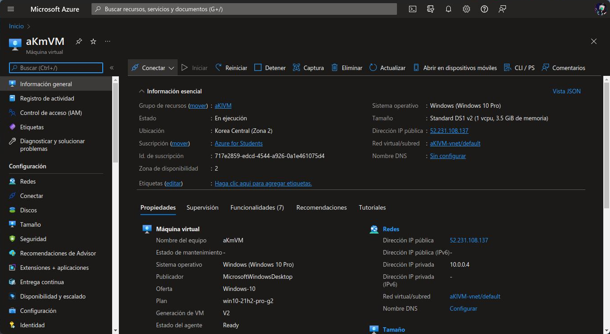

La opcion de ```Conectar``` en el recurso de la máquina virtual nos permite acceder a la máquina virtual por RDP usando un archivo tipo ```.rdp```.

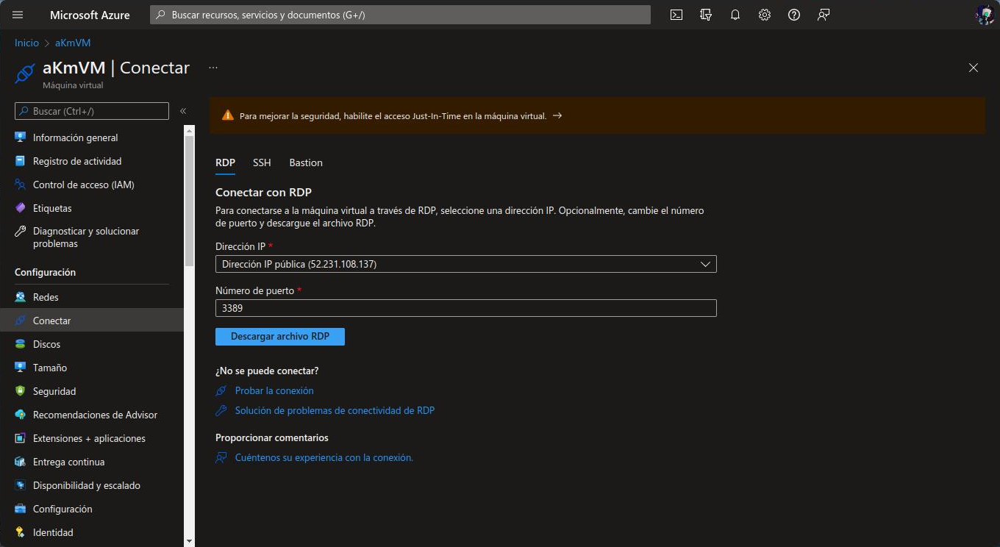

Al abrir el archivo ```.rdp``` se debe ingresar el usuario y la contraseña que se le asigno a la máquina virtual.

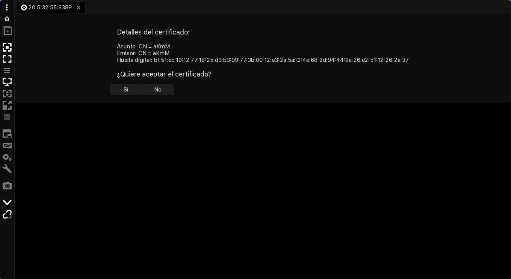

Para crear una segunda máquina virtual, solo se debe cambiar el nombre de la máquina virtual y seguir los mismos pasos que para la primera máquina virtual. Ademas, en la sección de redes, se debe utilizar la misma Red virtual que para la primera máquina virtual.

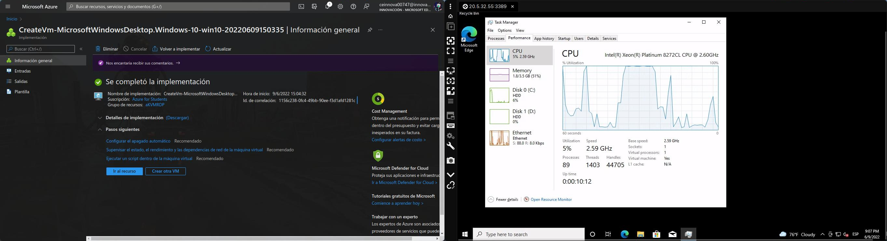

Con las dos maquinas virtuales creadas, podemos acceder desde la primera máquina virtual a la segunda máquina virtual usando el comando 

    mtsc /v:<direccion de la segunda máquina virtual>

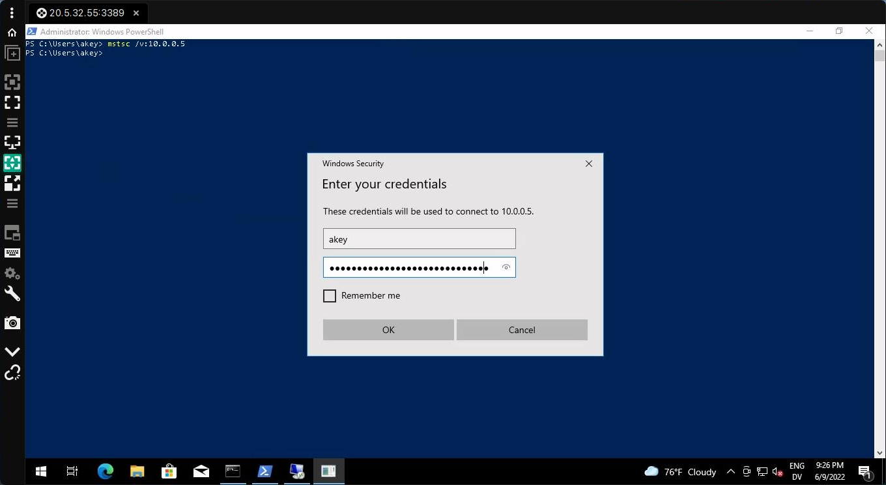

En Windows, la herramienta ```Escritorio remoto de Microsoft``` nos permite omitir preguntas de confirmación al acceder a la máquina virtual.

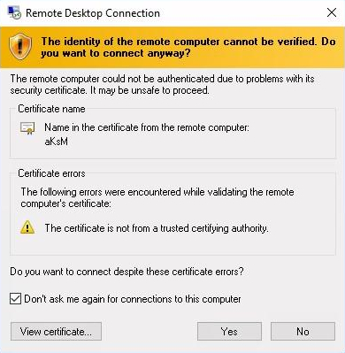

Si todo esta correcto, podemo acceder a la segunda máquina virtual a través de la primera máquina virtual.
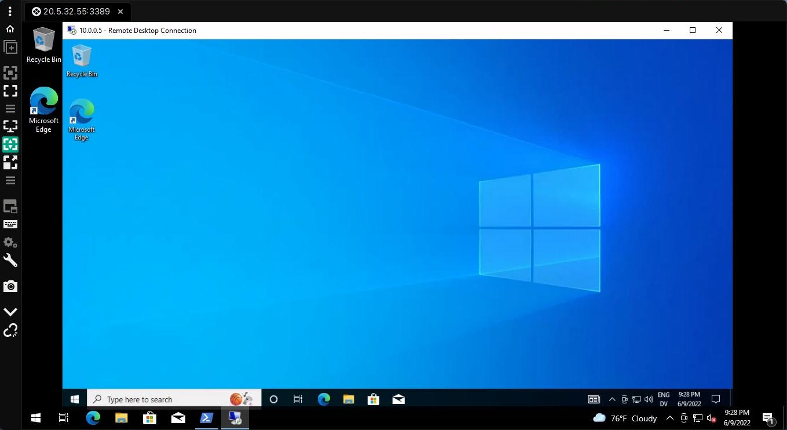